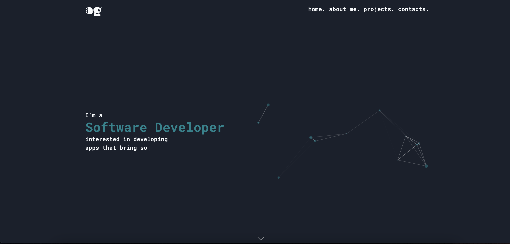

# armandoguarino.dev




Welcome to my personal portfolio page!

It was developed with the following tools:
<ul>
  <li>NextJS</li>
  <li>Chakra-ui</li>
  <li>EmailJS</li>
  <li>React-icons</li>
  <li>React-tsparticles</li>
  <li>Typewriter-effect</li>
  </ul>
  
## Installing armandoguarino.dev

To install armandoguarino.dev, follow these steps:

Linux and macOS:
```
npm install
```

Windows:
```
npm install
```

## Contributing to armandoguarino.dev
<!--- If your README is long or you have some specific process or steps you want contributors to follow, consider creating a separate CONTRIBUTING.md file--->
To contribute to armandoguarino.dev, follow these steps:

1. Fork this repository.
2. Create a branch: `git checkout -b <branch_name>`.
3. Make your changes and commit them: `git commit -m '<commit_message>'`
4. Push to the original branch: `git push origin <project_name>/<location>`
5. Create the pull request.

Alternatively see the GitHub documentation on [creating a pull request](https://help.github.com/en/github/collaborating-with-issues-and-pull-requests/creating-a-pull-request).

## Contributors

Thanks to the following people who have contributed to this project:

* [@guarmo](https://github.com/guarmo) 📖

## Contact

If you want to contact me you can reach me at <arm.guarino@gmail.com>.

## License

MIT License

Copyright (c) [2021] [Armando Guarino]

Permission is hereby granted, free of charge, to any person obtaining a copy
of this software and associated documentation files (the "Software"), to deal
in the Software without restriction, including without limitation the rights
to use, copy, modify, merge, publish, distribute, sublicense, and/or sell
copies of the Software, and to permit persons to whom the Software is
furnished to do so, subject to the following conditions:

The above copyright notice and this permission notice shall be included in all
copies or substantial portions of the Software.

THE SOFTWARE IS PROVIDED "AS IS", WITHOUT WARRANTY OF ANY KIND, EXPRESS OR
IMPLIED, INCLUDING BUT NOT LIMITED TO THE WARRANTIES OF MERCHANTABILITY,
FITNESS FOR A PARTICULAR PURPOSE AND NONINFRINGEMENT. IN NO EVENT SHALL THE
AUTHORS OR COPYRIGHT HOLDERS BE LIABLE FOR ANY CLAIM, DAMAGES OR OTHER
LIABILITY, WHETHER IN AN ACTION OF CONTRACT, TORT OR OTHERWISE, ARISING FROM,
OUT OF OR IN CONNECTION WITH THE SOFTWARE OR THE USE OR OTHER DEALINGS IN THE
SOFTWARE.
